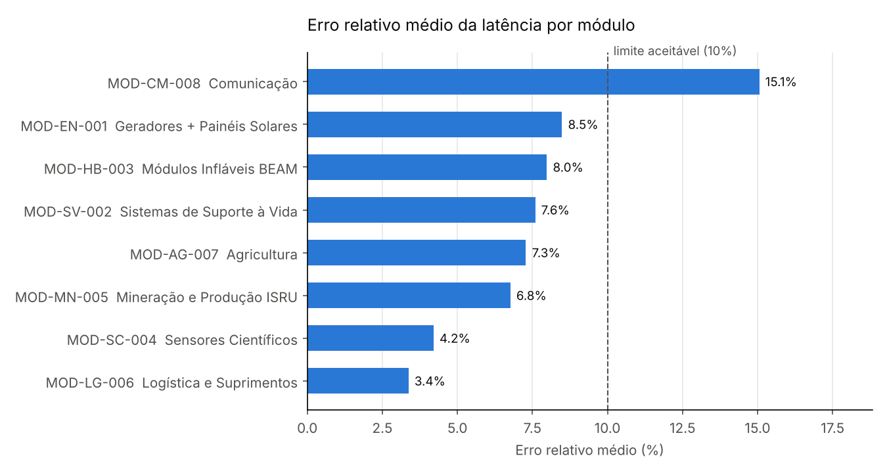

<div align="center">

# Sistema de Comunicação Interplanetária da Colônia
**Colônia Aurora Siger · Fase 6 — A Aurora Estabelece Comunicação Interplanetária com Inteligência e Precisão**


</div>

---

## O que é o SCIC?

O SCIC é a camada de avaliação, organização e interpretação técnica dos dados de comunicação da Colônia Aurora Siger. Ele monitora a **latência de comunicação dos 8 módulos da colônia**, calcula erros entre valores previstos e observados, treina um modelo simples de previsão, prioriza alertas críticos com **heap** e permite buscas rápidas por prefixo com **trie**.

> A latência analisada é a da **rede interna da colônia** (comunicação entre módulos), medida em milissegundos. O atraso Terra–Marte (3 a 22 minutos) é fixo pela distância entre os planetas e não entra no modelo.

---

## Equipe

| Nome | RM |
|---|---|
| Isabelle Caroline de Camargo Francisco | 572096 |
| Matheus Lyncoln Souza Dias | 570765 |
| Mirela Aparecida Bispo Miguel | 570830 |
| Rodrigo Abrantes Mizerani | 571808 |

---

## Início rápido

```bash
# Instale as dependências (uma vez):
pip install -r requirements.txt

# Execute o sistema:
python codigo_fonte.py

# Windows
py codigo_fonte.py
```

---

## Menu do sistema

```
╔══════════════════════════════════════════════════════╗
║           SCIC — Colônia Aurora Siger                ║
╠══════════════════════════════════════════════════════╣
║  1. Consultar registros da colônia                   ║
║  2. Indicadores e erros numéricos                    ║
║  3. Modelo de previsão de latência   [Regressão]     ║
║  4. Priorizar alertas                [Heap]          ║
║  5. Buscar registros por prefixo     [Trie]          ║
║  6. Hardware: bases e eletricidade   [COA]           ║
║  7. Análise final                                    ║
║  0. Sair                                             ║
╚══════════════════════════════════════════════════════╝
```

---

## A base de dados

O arquivo `dados_aurora_siger.csv` traz **48 registros simulados**: os mesmos 8 módulos das fases anteriores (MOD-EN-001 a MOD-CM-008), acompanhados ao longo de 6 ciclos de operação.

| Coluna | Descrição |
|--------|-----------|
| `codigo_modulo` | Código do módulo (ex.: MOD-CM-008) |
| `modulo` / `tipo` | Nome e tipo do módulo |
| `codigo_sensor` | Código do sensor em decimal (convertido para binário e hexadecimal no sistema) |
| `latencia_obs` / `latencia_prev` | Latência observada e prevista, em ms |
| `tensao` / `corrente` | Tensão (V) e corrente (A) do transmissor |
| `status` | ativo, manutenção ou alerta |
| `prioridade_alerta` | Urgência do alerta, de 1 (baixa) a 5 (crítica) |
| `mensagem` | Resumo do alerta |
| `ciclo` | Ciclo de registro (1 a 6) |

**Critério de alerta:** erro relativo acima de 10% gera alerta; acima de 25%, alerta crítico. Módulos essenciais (energia, suporte à vida, habitação, logística e comunicação) recebem prioridade maior.

Ao carregar a base, o sistema faz uma limpeza automática: padroniza textos, converte as colunas numéricas, descarta registros sem latência, tensão ou corrente e remove duplicados.

---

## Funcionalidades

| Opção | O que faz | Arquivo | Status |
|-------|-----------|---------|--------|
| 1 | Resumo da base e consultas por módulo, status e tipo | `dados.py` | ✅ Pronto |
| 2 | Erro absoluto e relativo, indicadores, erros por módulo, ponto flutuante e gráfico | `analise.py` | ✅ Pronto |
| 3 | Regressão linear para prever a latência, com MAE, MSE, RMSE e R² | `modelo.py` | 🚧 Em desenvolvimento |
| 4 | Priorização dos alertas mais críticos com heap | `estruturas.py` | 🚧 Em desenvolvimento |
| 5 | Busca de módulos e códigos por prefixo com trie | `estruturas.py` | 🚧 Em desenvolvimento |
| 6 | Código do sensor em binário e hexadecimal, potência (P = V × I) e resistência (R = V / I) | `hardware.py` | ✅ Pronto |
| 7 | Análise final: situação geral, módulo mais preocupante, tendência e recomendações | `analise.py` | ✅ Pronto |

As opções em desenvolvimento mostram um aviso no menu em vez de interromper o sistema.

---

## Análise de erros

O erro é calculado entre a latência prevista e a observada em cada registro:

```
erro absoluto = |latência observada − latência prevista|        (ms)
erro relativo = erro absoluto / latência observada               (%)
```

O erro absoluto diz quantos milissegundos a previsão errou. O erro relativo permite comparar módulos com escalas diferentes: 20 ms de erro é grave para um módulo de 80 ms, mas pequeno para um de 300 ms.

| Erro relativo | Classificação | Significado para a colônia |
|---------------|---------------|----------------------------|
| até 10% | Aceitável | Variação normal da rede interna |
| 10% a 25% | Atenção | Módulo deve ser acompanhado |
| acima de 25% | Crítico | Risco de atraso em comandos e alertas |

### Indicadores da base atual

| Indicador | Valor |
|-----------|-------|
| Latência média observada | 161,2 ms |
| Latência média prevista | 150,4 ms |
| Registros acima do previsto | 58,3% |
| Erro absoluto médio | 14,6 ms |
| Erro relativo médio | 7,6% |
| Registros com erro aceitável | 83,3% |
| Registros críticos (> 25%) | 6 |
| Disponibilidade (status ativo) | 68,8% |



O módulo de **Comunicação (MOD-CM-008)** é o único com erro relativo médio acima do limite aceitável (15,1%), com pior caso de 40,0% no ciclo 3. Como os alertas de todos os módulos dependem dele, ele é tratado como prioridade máxima.

**Ponto flutuante:** o sistema mostra que `120.6 − 119.9` resulta em `0.6999999999999886` no Python, por causa da representação binária dos decimais. O desvio (cerca de 10⁻¹⁴ ms) é irrelevante diante da precisão do sensor (0,1 ms), mas por isso o sistema nunca compara decimais com `==`: usa limites e arredonda apenas na exibição.

---

## Estrutura de arquivos

```
SCIC-Aurora-Siger
├── codigo_fonte.py          # sistema principal — execute aqui
├── dados.py                 # leitura, limpeza e consulta da base
├── analise.py               # indicadores, erro absoluto e relativo, análise final
├── modelo.py                # regressão linear e métricas
├── estruturas.py            # heap e trie
├── hardware.py              # bases numéricas, potência e Lei de Ohm
├── dados_aurora_siger.csv   # base de dados simulada
├── relatorio_tecnico.md     # relatório técnico do projeto
├── requirements.txt         # dependências
├── link_video.txt           # link do vídeo (YouTube · Não listado)
├── .gitignore               # arquivos temporários ignorados pelo Git
└── graficos_ou_imagens/
    └── erro_relativo_por_modulo.png
```

> Todos os arquivos `.py` e o CSV devem ficar na mesma pasta. Os gráficos são gerados automaticamente em `graficos_ou_imagens/` ao executar a opção 2.

---

## Dependências

| Biblioteca | Uso |
|------------|-----|
| `pandas` | Leitura, limpeza e consulta da base |
| `numpy` | Cálculos numéricos |
| `matplotlib` | Gráficos de latência e erros |
| `scikit-learn` | Regressão linear, divisão treino/teste e métricas |

Heap, trie e conversões de base usam apenas a biblioteca padrão do Python.

---

## Conceitos aplicados

`Erro absoluto` `Erro relativo` `Ponto flutuante` `Regressão linear` `MAE` `MSE` `RMSE` `R²`
`Heap` `Heapify-up` `Heapify-down` `Trie` `Busca por prefixo` `Bases numéricas`
`Lei de Ohm` `Potência` `Redes inteligentes de comunicação` `Manutenção preditiva`

<div align="center">
<sub>FIAP · Fase 6 — Comunicação Interplanetária · Colônia Aurora Siger</sub>
</div>
